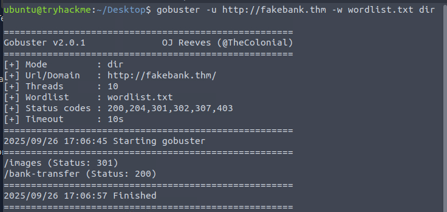
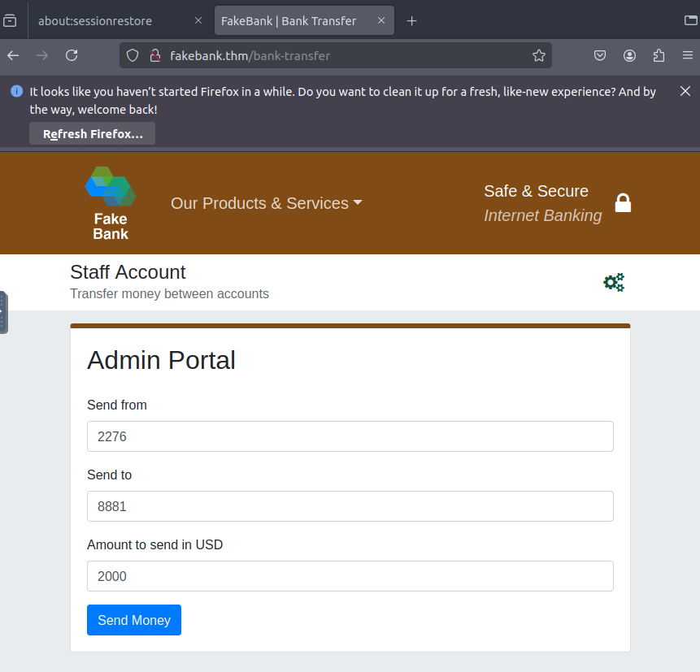

THM - Offensive Security Intro (reporte)
**Introducción**
En este laboratorio el objetivo principal era comprometer una página web de un banco, encontrar un directorio oculto y realizar una transferencia desde la cuenta `staff` del banco.

**Herramientas utilizadas** 
- `gobuster`

**Proceso** 
1. Buscamos directorios ocultos con `gobuster` usando la siguiente instrucción:
   `gobuster -u http://fakebank.thm -w wordlist.txt`
   *Explicación*: `-u` especifica la URL del objetivo y `-w` la wordlist que usaremos para enumerar directorios.

2. El escaneo devolvió dos resultados relevantes:
- `/images` — da error al intentar acceder.
- `/bank-transfer` — accesible.

3. Al acceder a `/bank-transfer` encontramos un portal de administración desde el que, introduciendo números de cuenta y una cantidad, es posible transferir fondos:

**Observaciones y conclusiones**

- El directorio `/bank-transfer` permite transferencias sin autenticación adicional, lo que indica una vulnerabilidad grave de control de acceso y validación de entradas.
    
- Sería recomendable:
    
    - Implementar autenticación y autorización robustas en las páginas sensibles.
        
    - Validar y sanitizar todas las entradas de usuario en el servidor.
        
    - Registrar y monitorear transacciones para detectar actividad anómala.